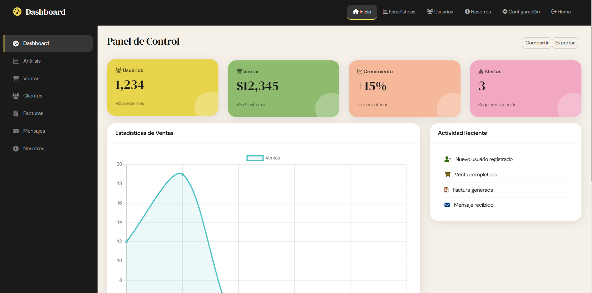

<div align="center">

# Dashboard Laravel

### Panel de control administrativo construido con Laravel 11, Bootstrap 5 y PostgreSQL

[](https://laravel.com)
[](https://php.net)
[](https://postgresql.org)
[](https://getbootstrap.com)

<br/>



<br/>

> Proyecto académico — Programación Avanzada 2025

</div>

---

## Tabla de Contenidos

- [Vista general](#-vista-general)
- [Características](#-características)
- [Stack tecnológico](#-stack-tecnológico)
- [Estructura del proyecto](#-estructura-del-proyecto)
- [Instalación y configuración](#-instalación-y-configuración)
- [Rutas disponibles](#-rutas-disponibles)
- [Sistema de autenticación](#-sistema-de-autenticación)
- [Vistas y módulos](#-vistas-y-módulos)
- [Sistema de diseño](#-sistema-de-diseño-soft-ui)
- [Base de datos](#-base-de-datos)
- [Equipo](#-equipo)

---

## Vista General

**Dashboard Laravel** es una aplicación web de panel de control administrativo que demuestra el uso práctico de los conceptos fundamentales de Laravel:

- Sistema de rutas con nombre (`->name()`)
- Layout base reutilizable con `@extends` y `@yield`
- 11 vistas Blade completas
- Autenticación completa (login, registro, logout)
- Modelos Eloquent con migraciones PostgreSQL
- Diseño responsive Soft UI personalizado
- Gráficos interactivos con Chart.js
- Formulario PQRS completo
- Galería de imágenes + video embebido

---

## Características

| Módulo | Descripción |
|--------|-------------|
| **Autenticación** | Login, registro y logout con validación completa y hashing bcrypt |
| **Dashboard** | Métricas en tiempo real con 4 tarjetas KPI y gráfico de líneas |
| **Estadísticas** | 4 gráficos Chart.js: ventas, género, productos top, distribución |
| **Análisis** | Tráfico web, conversiones, fuentes de tráfico, páginas más visitadas |
| **Ventas** | Listado de órdenes con estados: Completado, Pendiente, En camino |
| **Clientes** | Administración con segmentación Premium/Regular/Ocasional |
| **Facturas** | Estado de pagos con filtros por Pagada/Pendiente/Vencida |
| **Mensajes** | Bandeja de entrada con panel de chat y contador de no leídos |
| **Configuración** | Tabs: Perfil, Seguridad (2FA), Notificaciones, Sistema |
| **Nosotros** | Equipo, galería, video tutorial embebido y formulario PQRS |

---

## Stack Tecnológico

```
Backend          Laravel 11 / PHP 8.2
Base de Datos    PostgreSQL 15
Frontend         Bootstrap 5.3 (CDN) + CSS personalizado
Gráficos         Chart.js (CDN)
Iconos           Font Awesome 6 (CDN)
Tipografía       DM Serif Display + DM Sans (Google Fonts)
Gestor de deps   Composer
CLI              Laravel Artisan
```

---

## Estructura del Proyecto

```
dashboard/
├── app/
│   ├── Http/
│   │   └── Controllers/
│   │       └── AuthController.php       # Login, registro, logout
│   └── Models/
│       ├── User.php                     # Modelo de usuarios
│       ├── Cliente.php                  # Modelo de clientes
│       ├── Venta.php                    # Modelo de ventas
│       ├── Factura.php                  # Modelo de facturas
│       └── Mensaje.php                  # Modelo de mensajes
│
├── database/
│   └── migrations/                      # Migraciones de todas las tablas
│
├── public/
│   └── css/
│       └── dashboard.css                # Sistema de diseño Soft UI
│
├── resources/
│   └── views/
│       ├── layouts/
│       │   ├── app.blade.php            # Layout dashboard (navbar + sidebar)
│       │   └── auth.blade.php           # Layout autenticación (limpio)
│       ├── home.blade.php               # Login / Registro (2 paneles)
│       ├── signup.blade.php             # Formulario de registro
│       ├── welcome.blade.php            # Dashboard principal
│       ├── estadisticas.blade.php
│       ├── analisis.blade.php
│       ├── ventas.blade.php
│       ├── clientes.blade.php
│       ├── facturas.blade.php
│       ├── mensajes.blade.php
│       ├── configuracion.blade.php
│       └── nosotros.blade.php
│
├── routes/
│   └── web.php                          # Definición de las 11 rutas
│
├── .env.example                         # Plantilla de configuración
└── composer.json                        # Dependencias PHP
```

---

## Instalación y Configuración

### Prerrequisitos

Asegúrate de tener instalado:

- **PHP** >= 8.2
- **Composer** >= 2.x
- **PostgreSQL** >= 15
- **Git**

### 1. Clonar el repositorio

```bash
git clone https://github.com/sofih-ii/Dashboard_php.git
cd dashboard-laravel
```

### 2. Instalar dependencias PHP

```bash
composer install
```

### 3. Configurar el entorno

```bash
# Copiar el archivo de entorno
cp .env.example .env

# Generar la clave de la aplicación
php artisan key:generate
```

### 4. Configurar la base de datos

Edita el archivo `.env` con tus credenciales de PostgreSQL:

```env
DB_CONNECTION=pgsql
DB_HOST=127.0.0.1
DB_PORT=5432
DB_DATABASE=dashboard_db
DB_USERNAME=postgres
DB_PASSWORD=tu_contraseña_aqui
```

### 5. Ejecutar las migraciones

```bash
# Crear todas las tablas en la BD
php artisan migrate

# Verificar el estado de las migraciones
php artisan migrate:status
```

### 6. Crear usuario de prueba

```bash
php artisan tinker
```

```php
\App\Models\User::create([
    'name'     => 'Admin',
    'email'    => 'admin@dashboard.com',
    'password' => bcrypt('123456'),
]);
```

### 7. Iniciar el servidor

```bash
php artisan serve
```

**Abre el navegador en:** `http://127.0.0.1:8000`

> **Credenciales de prueba:**
> - Email: `admin@dashboard.com`
> - Contraseña: `123456`

---

## Rutas Disponibles

| Método | URL | Nombre | Descripción |
|--------|-----|--------|-------------|
| `GET` | `/` | `home` | Pantalla de login — punto de entrada |
| `POST` | `/login` | `login` | Procesa el formulario de login |
| `POST` | `/logout` | `logout` | Cierra la sesión del usuario |
| `GET` | `/signup` | `signup` | Formulario de registro |
| `POST` | `/signup` | `register` | Procesa el registro de cuenta |
| `GET` | `/dashboard` | `dashboard` | Panel principal con métricas |
| `GET` | `/estadisticas` | `estadisticas` | Estadísticas con gráficos |
| `GET` | `/analisis` | `analisis` | Análisis de tráfico |
| `GET` | `/ventas` | `ventas` | Gestión de ventas |
| `GET` | `/clientes` | `clientes` | Administración de clientes |
| `GET` | `/facturas` | `facturas` | Facturación |
| `GET` | `/mensajes` | `mensajes` | Bandeja de mensajes |
| `GET` | `/configuracion` | `configuracion` | Configuración del sistema |
| `GET` | `/nosotros` | `nosotros` | Información del equipo y PQRS |

```bash
# Ver todas las rutas en la terminal
php artisan route:list
```

---

## Sistema de Autenticación

Implementado con el sistema Auth nativo de Laravel sin paquetes adicionales:

```
Usuario visita /
    ↓
AuthController::showLogin() → muestra home.blade.php
    ↓
POST /login → Auth::attempt(credentials)
    ↓ éxito                    ↓ fallo
session regenerate()       withErrors(['email' => '...'])
redirect('/dashboard')     back() con mensaje de error
    ↓
POST /logout → Auth::logout() → session invalidate → redirect('/')
```

**Seguridad implementada:**
- Contraseñas hasheadas con `bcrypt` — nunca en texto plano
- Protección CSRF en todos los formularios (`@csrf`)
- `session()->regenerate()` previene Session Fixation Attack
- Validación server-side en todos los campos

---

## Vistas y Módulos

### Layout Base — Herencia con Blade

Todos los módulos del dashboard heredan `layouts/app.blade.php`:

```blade
@extends('layouts.app')

@section('title', 'Mi Página - Dashboard')
@section('side_ventas', 'active')   {{-- Activa el ítem en el sidebar --}}

@section('content')
    {{-- Solo el contenido único de esta página --}}
@endsection

@section('scripts')
    {{-- Scripts específicos de esta vista --}}
@endsection
```

**Beneficio:** El navbar, sidebar y todas las importaciones de CSS/JS están definidos **una sola vez** en el layout. Cualquier cambio se propaga automáticamente a las 11 vistas.

### Gráficos con Chart.js

Cada vista que necesita gráficos los define en su sección de scripts:

```javascript
new Chart(document.getElementById('miGrafico').getContext('2d'), {
    type: 'line', // bar | pie | doughnut
    data: {
        labels: ['Ene', 'Feb', 'Mar', 'Abr', 'May', 'Jun'],
        datasets: [{ label: 'Ventas', data: [8000, 12000, 9500, 14000, 16000, 18500] }]
    }
});
```

---

## Sistema de Diseño Soft UI

Paleta de colores definida con variables CSS en `public/css/dashboard.css`:

```css
:root {
    --cream:          #f5f0e8;  /* Fondo general */
    --sidebar-bg:     #1a1a1a;  /* Navbar y sidebar */
    --card-yellow:    #e8d44d;  /* Métricas principales */
    --card-pink:      #f2a7c3;  /* Alertas */
    --card-green:     #8fbb6e;  /* Éxito / ventas */
    --card-blue:      #a8c8e8;  /* Información */
    --card-lavender:  #c5b8e8;  /* Secundario */
    --card-peach:     #f5b89a;  /* Advertencia */
}
```

**Tipografía:**
- `DM Serif Display` — Títulos y números destacados
- `DM Sans` — Texto de cuerpo, etiquetas y navegación

---

## Base de Datos

### Modelos y sus tablas

| Modelo | Tabla | Campos principales |
|--------|-------|--------------------|
| `User` | `users` | name, email, password, remember_token |
| `Cliente` | `clientes` | nombre, email, telefono, estado |
| `Venta` | `ventas` | cliente_id, total, estado, fecha |
| `Factura` | `facturas` | venta_id, monto, estado, vencimiento |
| `Mensaje` | `mensajes` | usuario_id, contenido, leido, created_at |

### Comandos de base de datos

```bash
# Ejecutar migraciones
php artisan migrate

# Revertir la última migración
php artisan migrate:rollback

# Eliminar todo y volver a migrar (¡cuidado en producción!)
php artisan migrate:fresh

# Ver el estado de las migraciones
php artisan migrate:status
```

---

## Equipo

<table>
  <tr>
    <td align="center" width="50%">
      <h3>Sara Sofia Mora Trujillo</h3>
      <p><strong>Desarrollador Frontend</strong></p>
      <p>Diseño UI/UX · Vistas Blade · CSS Soft UI · Bootstrap 5</p>
    </td>
    <td align="center" width="50%">
      <h3>Jose Mauricio Cantuca Narvaez</h3>
      <p><strong>Desarrollador Backend</strong></p>
      <p>Laravel · PHP · PostgreSQL · Rutas · Controladores</p>
    </td>
  </tr>
</table>

> Proyecto académico — Materia: Programación Avanzada · 2025

---

## Licencia

Este proyecto fue desarrollado con fines académicos.

---

<div align="center">
  <sub>Construido usando Laravel 11 · PHP 8.2 · PostgreSQL · Bootstrap 5</sub>
</div>